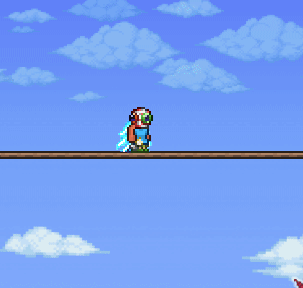

# RhosRequests

This repository contains all the source code for community requested mods. 

Found on: https://steamcommunity.com/sharedfiles/filedetails/?id=2813723898

Discord Link: https://discord.gg/EC7PybhE

## Arena Boots
Arena boots allow you to automatically place blocks as you walk. Enable automatic placement by pressing the default button 'p'.

##### Options:
 - **Enable Arena Boots**: Activates/Deactivates this mod
 - **Enable GroundCheck**: This allows you to only be able to place platforms when stand on tiles
 - **Allow Stone, Dirt and Wooden Blocks**: Extends functionality by allowing more blocks than platforms to be placed.

## Damage Variance
Allows you to overwrite Terraria's damage variance. 

##### Options:
 - **Enable Damage Variance**: Activates/Deactivates this mod
 - **Maximum Variance in %**: For Maximum Variance 125 this allows you to deal up to 25% more dmg
 - **Minimum Variance in %**: For Minimum Variance 75 this allows you to deal up to 25% less damage

## Derp soon more
